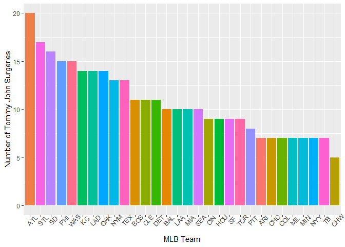
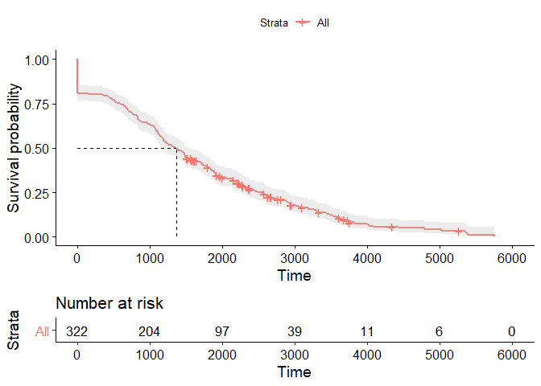
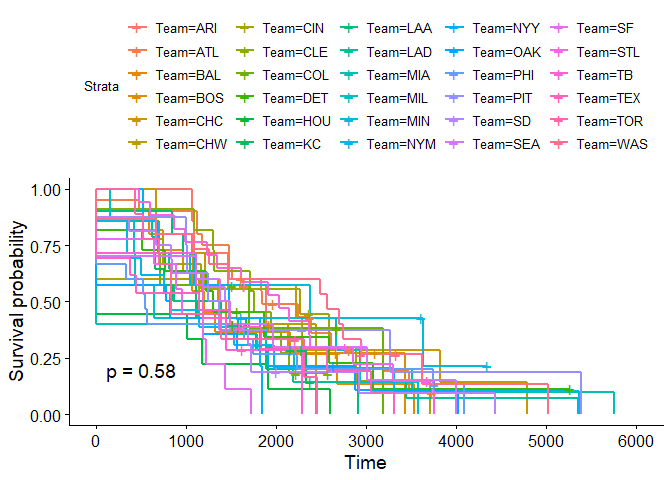

The Idea
--------

I set out to investigate the length of a major league baseball career
following Tommy John surgery. As the title suggests, I only considered
pitchers and not position players who underwent the procedure. I stuck
to players with MLB experience and not career minor leaguers (this is
something I am considering for a future analysis). I was also in whether
recovery times vaired by team.  
Additionally, this project gives me a chance to apply what I have learnt
about survival analysis. As I am not an expert on the topic, I certainly
consider this a work in progress.

Data
----

I used [this
document](https://docs.google.com/spreadsheets/d/1gQujXQQGOVNaiuwSN680Hq-FDVsCwvN-3AazykOBON0/edit#gid=0)
as the source of players who had undergone Tommy John and the date of
their surgery. To get the date of a players final appearance, I used
data from the [Chadwick
Bureau](https://github.com/chadwickbureau/baseballdatabank). I merged
the ‘People’ and ‘Pitching’ files with the list of players with Tommy
John to end up with my final list of players.

Scripts
-------

The packages I used for cleaning and presenting the data are in the
‘packages’ script. The ‘data\_cleaning’ script contains the R code used
to clean and merge the data to produce a usable dataset in a single
table. Key steps within the script were:

\*Excluding all players with surgeries during 2019 as they would still
be recovering

\*The game logs only extended to the end of 2018 and thus for the
majority of players their final game was simply their team’s last game
of the season. Thus I decided to classify any final games in 2018 as
censored. This is not perfect but hopefully isn’t too wrong.

\*If a player underwent a 2nd or 3rd TJ, it was counted as a ‘death’. If
they returned from the surgery, I would begin counting the days untli
the final game from that 2nd or 3rd surgery.

\*I worked under the assumption that the player would complete their
recovery from surgery and return to play all with the same team. This is
not always the case but I thought it would be reasonable to ignore the
exceptions to this for now.

The Analysis
------------

Since the first TJ surgery in 1974, every team has unsurprisingly had an
MLB player undergo the surgery. The numbers differ from team to team
though with Atlanta having the most and the White Sox the least as of
the end of the 2018 season.

Below is the survival curve containing all 322 pitchers on my list who
have had TJ.

    ## Warning in .pvalue(fit, data = data, method = method, pval = pval, pval.coord = pval.coord, : There are no survival curves to be compared. 
    ##  This is a null model.

There are a couple of things that stood out to me when looking at the
result.

\*A large number of players, \~20%, never make it back to pitch again,
as evidenced by the straight line at the start of the plot.

\*When looking at all the players together we see half the players have
played their final game \~1200 days (\~3.29 years) post Tommy John (The
dotted line).

\*For reference, the crosses mean the player was ‘censored’ it means
they are still playing. Therefore there are quite a few players past
that median point that are still yet to retire and will likely move that
median further along in the years to come.

\*The player with the longest career post TJ career didn’t play their
final game until \~5800 days (\~15.9 years) later.

It is important to remember that this plot includes all surgeries since
inception, results are likely better these days and thus I would imagine
the median career length would in fact be longer than the \~1200 days we
see here.

Finally, the plot below shows the survival curves by team but as you can
see, they are all a bit of a mess and there isn’t nearly enough data to
compare teams.

Next Steps
----------

As mentioned, only including MLB players left far too few players to do
much with and certainly not enough to compare differences between teams.
I would like to continue to build on this over time and thus my next
steps would be:

\*Incorporate MiLB data into the mix. Getting the data required to do
this is the hurdle to completing this at the moment so it may take some
time to figure out.

\*Improve accuracy of the “Final Game” date. At this point in time there
is no information about whether the final game was an MLB or MiLB game.
This information would add an interesting new dimension to the data
allowing us to know of those who returned to play after TJ, how many
made it back to the majors.

\*Consider breaking the data up into different eras to see whetehr there
is a difference in recovery between the early days of the surgery and
more recent decades.
